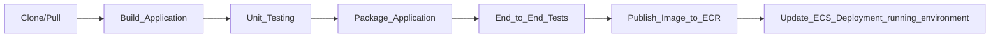

# AWS-ECS-Fargate-ha-CI_CD


> A highly available containerized application deployed on Amazon ECS with AWS Fargate, provisioned using Terraform and automatically deployed through a CI/CD pipeline with GitHub Actions, including monitoring with Grafana and container images stored in Amazon ECR.


## Table of Contents

- [Overview](#overview)
- [Architecture](#architecture)
- [Technology Stack](#technology-stack)
- [Prerequisites](#prerequisites)
- [Getting Started](#getting-started)
- [CI/CD Pipeline](#cicd-pipeline)
- [References](#references)


## Overview

This project demonstrates deploying a containerized application on Amazon ECS using Terraform for infrastructure provisioning and GitHub Actions for automated deployments. 
The application runs on AWS Fargate and includes two ECS services: one for the application and another for Grafana. 
Both services are exposed through an Application Load Balancer with separate routing paths. 
Container images are stored in Amazon Elastic Container Registry (ECR), demonstrating core DevOps practices such as Infrastructure as Code, containerization, monitoring, and CI/CD automation.


## Key Features

- Cloud-based infrastructure (AWS with Terraform)
- Multi-AZ deployment across two availability zones
- High availability with multiple ECS tasks and load balancing
- Secure network segmentation:
  - Public subnets for load balancing and NAT gateways
  - Private subnets for application containers
- Monitoring and observability with Grafana and Amazon CloudWatch
- CI/CD automation via GitHub Actions
- Containerization using Docker & ECR
- Deployment on Amazon ECS with AWS Fargate


## Architecture

**AWS infrastructure architecture Diagram**


-----------------------------------

**Comprehensive diagram**


## Technology Stack

| Category             | Technologies   |
| -------------------- | -------------- |
| **Infrastructure**   | Terraform |
| **Containerization** | Docker, ECS Fargate |
| **CI/CD**            | Github Actions |
| **Version Control**  |    GitHub  |
| **Application**      | Java Script, HTML, CSS |
| **Cloud**         | AWS |
| **Monitoring**         | Grafana |


## Prerequisites

Requirements for building and running the project:

- AWS CLI configured
- Terraform installed
- Docker installed

## Getting Started


### Infrastructure Setup

1. **Initialize Terraform & Configure AWS:**

```bash
aws configure
# set your Access Key & Secret Key or use AWS IAM 
terraform init
terraform plan
terraform apply
# make sure to shoutdown Infrastructure when finish with :
terraform destroy
```


### Grafana Setup

1. **Add CloudWatch as a Data Source**

Find out the application via ALB DNS output from terraform terminal :
<br>

> "http://ALB-DNS/grafana/login"


<br>


<br>
<br>

```bash
Once logged in:
- Go to Connections
- Click Add new connection
- Choose CloudWatch
```

2. **Configure CloudWatch Access**

```bash
In the CloudWatch data source settings:
- Name: (Give it any name)
- Authentication Provider: Choose from:
- Access and Secret Key (simplest way)
- AWS region: Choose where ECS hosted

Once configured, click Save and Test,
You should see a success message.
```

> **If using access & secret key, ensure the IAM user has CloudWatchReadOnlyAccess or a similar policy attached.**


3. **Explore Your Logs**

```bash
After the data source is connected:
- Click Explore from the left menu
- In the data source selector, choose CloudWatch

You will see two options:
- CloudWatch Metrics — CPU, memory, and other metrics
- CloudWatch Logs — actual log entries
Select the CloudWatch Logs option.

Then:
Choose the Log Group from the dropdown
```

4. **Run queries**

```bash
Examples:
- fields @timestamp, @message | sort @timestamp desc | limit 20
- fields @timestamp, @message | filter @message like /error/ | sort @timestamp desc | limit 20
- fields @timestamp, @message | filter @message like /500|error|exception/ | sort @timestamp desc | limit 50
```


## CI/CD Pipeline

**PIPELINE DESCRIPTION**



## References
- [Application Repository](https://github.com/tamer98/Memory_Cards_Game)
- [Grafana Setup](https://medium.com/@karthikthangaraj123/how-to-fetch-aws-ecs-application-logs-from-cloudwatch-into-grafana-dashboard-67ccbd062ed8)
